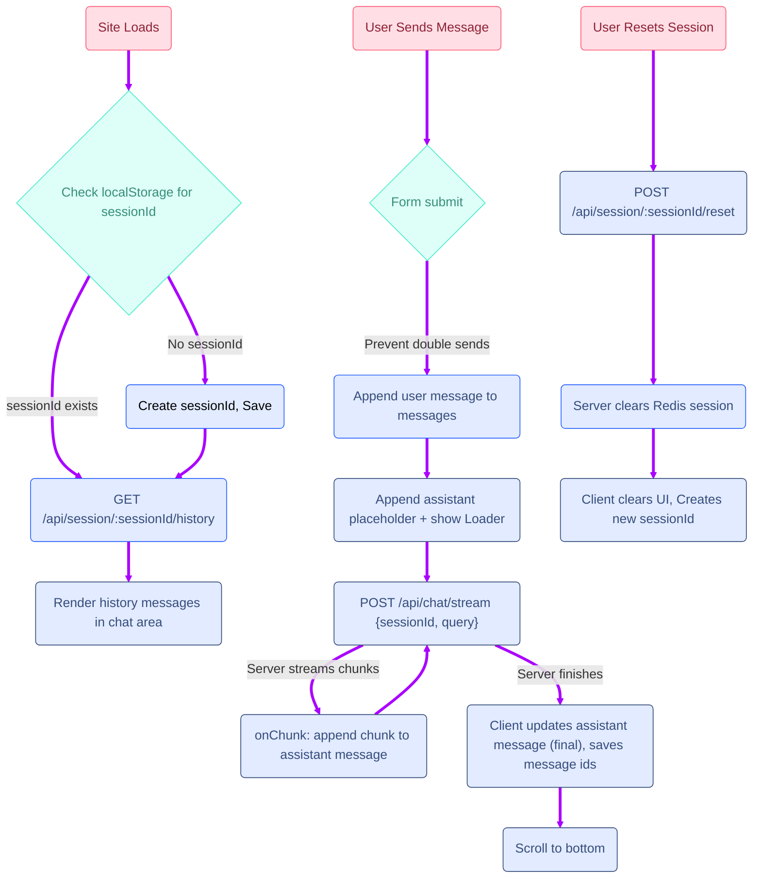

## RAG BASED AI CHAT BOT - FRONTEND

Frontend interface for the chatbot built with **Vite + React**.  
It connects with the backend, provides a chat-like UI, and manages sessions to deliver conversational experience.

## Overview

This project provides the **frontend interface** for the Retrieval-Augmented Generation (RAG) news application.  
It is designed around a chat UI that interacts with the backend APIs.

### Features
- Built with **Vite + React** for fast dev/build.  
- Chat interface styled with **SCSS**.  
- API integration via `chatApi.js`.  
- Maintains session ID for contextual queries.  
- Supports:
  - Sending queries to `/chat` endpoint.  
  - Displaying responses in real-time.  
  - Viewing and maintaining chat history per session.  

## ⚡ Tech Stack

1. **React + Vite** — Frontend framework and build tool.  
2. **Axios** — For API calls to the backend.  
3. **SCSS** — Styling for chat interface.  
4. **JavaScript (ES6+)** — Core logic.  

 

## 📂 Folder Structure
```
Frontend/
├── node_modules/ # Dependencies
├── public/ # Static assets
├── src/
│ ├── api/ # API integration
│ │ └── chatApi.js
│ │
│ ├── components/ # React components
│ │ └── Chat.jsx # Chat UI component
│ │
│ ├── styles/ # Stylesheets
│ │ └── Chat.scss # Chat styling
│ │
│ ├── App.jsx # Root React component
│ ├── main.jsx # Entry point
│ └── index.css # Global styles
│
├── .env # Environment variables
├── .env.example # Sample env config
├── .gitignore
├── eslint.config.js # Linting rules
├── index.html # App HTML template
├── package.json
├── package-lock.json
├── vite.config.js # Vite configuration
└── README.md

```

## 🏗️ Architecture




# ⚙️ Installation & How to Run

## Prerequisites
- Node.js 18+  
- npm / yarn / pnpm  
- Git  

---

## 📥 Clone and Install 

- Clone the repo into your directory using git clone <repo_url>. 
- Install all dependencies using `npm install` or `yarn install`  
- Create a `.env` file in the root folder (same level as `package.json`)  
  - Copy variables from `.env.example`  
  

---

## 🚀 Run the Project  

- Run `npm run dev` to start development server  
- Run `npm run build` to create production build  
-  

🎉 **Hurray! Your chatbot frontend is live...**

---

**Note:**  
- Make sure your **backend server** is running (locally or deployed).  
- Update `.env` with the correct backend API URL before running.

---


### 🖼️ Chat Interface
![Chat UI Demo]


